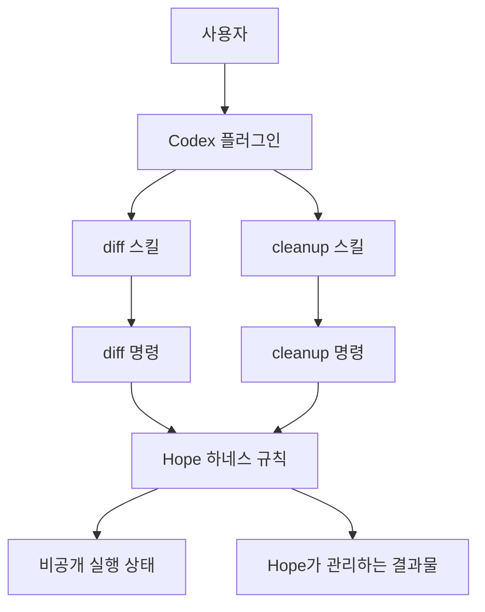

<p align="center">
  
</p>

<h1 align="center">Hope</h1>

<p align="center"><strong>실제 작업에서 시작해 조금씩 자라는 AI 작업 하네스</strong></p>

<p align="center"><a href="README.md">English</a></p>

Hope는 지금 바로 쓸 수 있는 Codex 플러그인이면서, 내부에서는 하네스로
자라고 있는 프로젝트다.

플러그인을 유지한 채 하네스를 만든다. 두 경로는 같은 코드를 사용한다.
따로 구현한 두 벌의 코드를 관리하지 않는다.

Hope의 장기 방향과 프로젝트의 판단 기준은
[PRINCIPLES.md](PRINCIPLES.md)에 정리되어 있다.

> **Alpha:** `v0.4.0-alpha`는 `diff`와 `cleanup` 스킬을 제공한다. 내부
> 하네스는 아직 빠르게 바뀔 수 있다.

## 지금 할 수 있는 일

### Pull request 이해하기

```text
$hope:diff
```

URL을 생략하면 현재 GitHub 저장소에서 생성 시각이 가장 최근인 PR을 고른다.
작성자와 lifecycle state는 제한하지 않는다. 현재 폴더가 GitHub 저장소가 아니거나
PR이 하나도 없으면 URL을 요청한다.

다른 PR을 보고 싶을 때는 URL을 전달한다.

```text
$hope:diff https://github.com/owner/repository/pull/123
```

`$hope:diff`는 선택한 GitHub pull request를 읽고 비공개 오프라인 파일 하나를
만든다.

```text
hope-review.html
```

Review에는 무엇이 왜 바뀌었는지, 중요한 동작과 위험, 핵심 코드, 이해를
확인하는 문제가 담긴다. 영어와 한국어를 지원한다.

Hope는 로그인된 GitHub CLI를 사용한다. URL을 전달하면 로컬 checkout이 필요하지
않다. URL을 생략한 경우 현재 저장소는 PR을 고를 때만 사용한다. 실제 수집은
GitHub CLI를 통해 pull request의 merge-base부터 head까지 진행한다. OpenAI API
key는 필요하지 않다.

### Hope 파일을 안전하게 지우기

```text
$hope:cleanup
```

Cleanup은 항상 두 단계로 동작한다.

1. Hope가 삭제할 항목을 먼저 보여준다.
2. 사용자가 확인한 항목만 삭제한다.

현재 cleanup이 지울 수 있는 항목은 다음과 같다.

- Hope가 만들고 표시한 비공개 임시 `hope-review.html` 파일
- 완료되었거나 취소된 비공개 `diff-run.json` 기록

내보낸 HTML, 실행 중인 작업, 프로젝트 파일, worktree, Git branch는 지우지
않는다. Branch cleanup은 Hope가 branch를 직접 만들고 그 사실을 기록하게 된
뒤에 추가한다. 이름이나 prefix만 보고 Hope 소유의 branch라고 추측하지 않는다.

## 설치

필요한 환경은 다음과 같다.

- Node.js 20 이상
- Pull request를 읽을 권한으로 로그인한
  [GitHub CLI](https://cli.github.com/)
- ChatGPT 구독으로 로그인한 Codex

```bash
codex plugin marketplace add dkstm95/hope --ref v0.4.0-alpha
codex plugin add hope@hope
```

설치 뒤 새 Codex 작업을 시작한다.

현재 저장소는 Codex 플러그인 패키지만 배포한다. 나중에 Claude adapter를
추가하더라도 같은 스킬과 하네스 명령을 감싸야 한다. 기능 코드를 복사하지
않는다.

## 내부 구조

Hope는 두 경로를 동시에 운영한다.



공개 경로는 플러그인과 스킬을 계속 쉽게 쓸 수 있게 한다. 하네스 경로는 실행
상태, 안전한 cleanup, 정확한 소유권 확인, 작은 명령 경계를 추가한다. 두 경로는
하나의 구현에서 만난다.

기능 코드는 기능 이름을 쓴다. Diff 흐름은 `DiffRun`을 사용하고, cleanup은
cleanup plan을 사용한다. 새 기능을 추가할 때마다 `XxxRunner`를 만들지 않는다.
두 기능이 실제로 같은 규칙을 필요로 할 때만 공통 이름을 만든다.

폴더와 명령 흐름, 새 기능을 추가하는 규칙은
[docs/architecture.md](docs/architecture.md)에 정리되어 있다.

## Diff 흐름

Diff 스킬은 작은 명령 집합 하나를 사용한다.

```text
start -> inspect -> validate -> render
                    \-> abandon
```

`start`는 비공개 `DiffRun`을 만들고 정확한 pull request 상태를 저장한다.
`inspect`는 정해진 크기의 페이지를 읽는다. `validate`는 review model을 검사한다.
`render`는 최종 HTML을 돌려주기 전에 GitHub 상태를 다시 확인한다.

Base, merge-base, head, 메타데이터, 파일 목록, fingerprint는 흐름 전체에서 같은
pull request 상태에 묶인다. 중간에 변경되면 서로 다른 두 버전을 섞지 않고 멈춘다.

큰 변경은 결정적인 `analysisPlan`으로 나눈다. 한 pass에는 변경 줄 최대 4,000개와
안전한 patch 최대 64 KiB가 들어간다. Inspector 응답 하나는 최대 16 KiB다.
전체 지원 범위는 commit 250개, 파일 200개, 변경 줄 20,000개, 안전한 patch
768 KiB, 정규화한 summary 128 KiB다. 전체 변경을 다룰 수 없으면 명확하게
중단한다.

간결하게 직렬화한 review model은 최대 4 MiB다. 같은 model이 보통의 JSON
들여쓰기 때문에 거부되지 않도록 파일 읽기는 최대 8 MiB까지 허용한다.

## 파일과 cleanup

Hope는 실행 상태를 운영체제의 비공개 임시 폴더에 둔다. 대상 프로젝트에
`.hope/` 폴더를 만들지 않는다. 캐시, 네트워크 서비스, 데이터베이스, review
registry도 없다.

기본 review에는 생성 7일 뒤로 고정된 `eligibleAfter` 표시가 들어간다. 이후의
render가 만료된 review를 지울 수 있다. `$hope:cleanup`은 그 전에도 관리 대상
review를 먼저 보여주고, 확인을 받은 뒤 지울 수 있다.

Cleanup preview는 수명이 짧은 plan을 만든다. 삭제하려면 정확한 plan 경로와
digest가 필요하다. 삭제 직전에 파일의 identity도 다시 확인한다. Preview 뒤에
파일이 바뀌면 삭제하지 않는다.

명시적으로 내보낸 파일에는 Hope cleanup 표시가 없다. Hope는 그 파일을
덮어쓰거나 삭제하지 않는다.

## 안전 경계

Pull request의 글, 경로, patch, model이 만든 글은 신뢰하지 않는 데이터다. 이
내용은 작업 흐름을 바꿀 수 없다. Hope는 model이 만든 shell, HTML, CSS,
JavaScript, SVG, URL을 실행하지 않는다.

인증은 GitHub CLI가 맡는다. Hope는 token을 읽거나 저장하지 않는다. 수집 작업은
읽기 전용이다. 비밀값으로 보이는 patch 본문은 review 근거로 들어가기 전에
제외한다.

Cleanup은 확실할 때만 지운다. 정확한 비공개 경로, 이름, 권한, 파일 종류,
가능한 경우 소유자와 identity가 모두 맞아야 한다. 하나라도 확실하지 않으면
그대로 둔다.

전체 보안 모델은 [SECURITY.md](SECURITY.md)를 참고한다.

## 개발

Dependency 설치는 필요하지 않다.

```bash
npm run check
```

테스트는 네트워크 없이 항상 같은 결과를 낸다. 배포 검사는 두 스킬, runtime
파일, 플러그인 manifest, 배포 버전을 함께 확인한다.

새 기능을 추가할 때는 다음 순서를 따른다.

1. 사용자의 목표와 기능 폴더에 쉬운 이름을 붙인다.
2. 작고 분명한 명령 집합을 만든다.
3. 상태를 비공개로 명시해서 저장한다.
4. 실제로 쓸 만할 때 스킬로 공개한다.
5. 다른 기능도 같은 규칙을 필요로 할 때만 코드를 공유한다.

작업 규칙은 [CONTRIBUTING.md](CONTRIBUTING.md)를 참고한다.

## 라이선스

[MIT](LICENSE)
