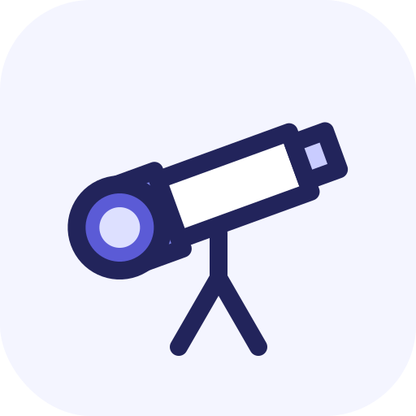

<p align="center">
  
</p>

<h1 align="center">DiffScope</h1>

<p align="center"><strong>Understand the code AI just finished—before you approve it.</strong></p>

<p align="center">
  <a href="https://dkstm95.github.io/diff-scope/demo/"><strong>Try the zero-install demo</strong></a>
  ·
  <a href="README.ko.md">한국어</a>
</p>

Start in the browser with a synthetic example—no installation, repository, or
API key required. The demo is published from `main`; its URL may return 404
until the first GitHub Pages deployment completes.

After installing, simply ask Codex:

```text
Explain the local change I just finished, then quiz me and make it explorable.
```

DiffScope turns one completed local code change into three connected learning
artifacts:

- **Explain** — see the before-to-after behavior, causal path, decisions, risks,
  and evidence;
- **Check** — answer an auto-scored quiz about predictions and invariants;
- **Explore** — vary inputs in an offline interactive microworld and inspect the
  changed behavior.

**Alpha scope:** one completed local `HEAD -> working tree` change, including
staged, unstaged, and safe untracked text files. DiffScope runs inside your
active Codex session with a ChatGPT subscription. It needs no API key, model
provider setup, or separate server.

> **Alpha:** `v0.1.1-alpha` adds the first-run demo and bilingual output to the
> public dogfooding build. Interfaces and artifact schemas may still change.

## Install

Requirements: Git, Node.js 20 or newer, and Codex signed in with a ChatGPT
subscription.

Copy this request into Codex:

```text
Install DiffScope v0.1.1-alpha from https://github.com/dkstm95/diff-scope.
Verify that diff-scope@diff-scope is enabled, then tell me to start a new Codex task.
Do not run $diff yet.
```

Or use the CLI:

```bash
codex plugin marketplace add dkstm95/diff-scope --ref v0.1.1-alpha
codex plugin add diff-scope@diff-scope
```

Start a new Codex task after installation so the new skill is loaded.

## Use

Finish one local coding task, start a new Codex task, and ask naturally:

```text
Explain the local change I just finished, then quiz me and make it explorable.
```

Or invoke the skill directly:

```text
$diff
```

DiffScope writes a private temporary bundle by default:

- `artifact.json` — validated source data bound to the exact collected context;
- `explanation.md` — the goal, causal path, decisions, risks, and evidence;
- `index.html` — the explanation, auto-scored quiz, and offline microworld.

Ask for a durable output directory when you want to keep the bundle.

## Alpha scope

DiffScope analyzes only:

```text
HEAD -> current working tree
```

That includes staged, unstaged, and safe untracked text files. The alpha assumes
the working tree contains one completed work unit. Separate unrelated changes
before invoking `$diff`.

Commit ranges, branches, pull requests, remote changes, API providers, CI batch
generation, binary files, generated files, and lockfiles are outside this
release's supported scope.

## Safety boundary

Repository contents in the selected scope are processed by the active Codex
service. The local collector bounds file count, changed lines, bytes, and time;
blocks common secret paths; redacts suspected credentials; disables external Git
diff helpers; and treats the repository as untrusted input.

The final HTML is rendered from a fixed runtime. It does not execute
model-authored HTML, CSS, JavaScript, SVG, URLs, or shell commands, and it needs
no network connection. Secret detection is a guardrail, not a guarantee, so
review the collected scope before using DiffScope on sensitive repositories.

## Develop

The deterministic collector, validator, renderer, quiz, and microworld runtime
use only Node.js built-ins. Tests do not call Codex or the network.

```bash
npm test
npm run check
```

Repository layout:

```text
.agents/plugins/marketplace.json     Codex marketplace
plugins/diff-scope/                  distributable plugin
  .codex-plugin/plugin.json
  skills/diff/                       shared skill and deterministic runtime
test/                                collector and renderer tests
tools/check-release.mjs              release/package consistency checks
```

See [CONTRIBUTING.md](CONTRIBUTING.md) for development rules and
[SECURITY.md](SECURITY.md) for private vulnerability reporting.

## License

[MIT](LICENSE)
