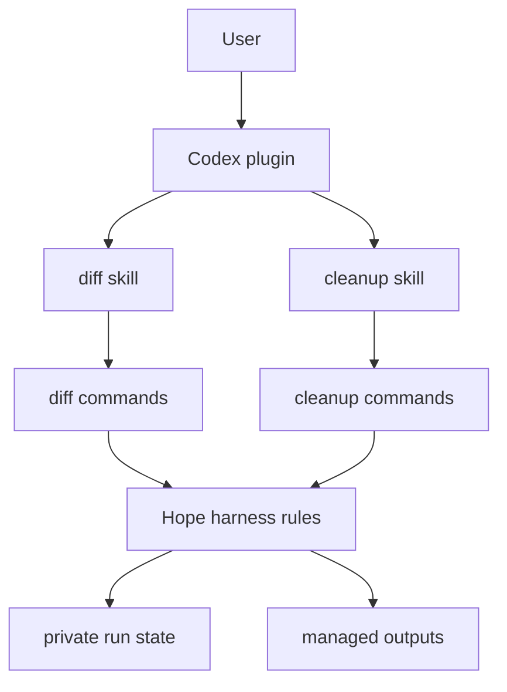

<p align="center">
  
</p>

<h1 align="center">Hope</h1>

<p align="center"><strong>A small AI work harness that grows from real workflows.</strong></p>

<p align="center"><a href="README.ko.md">한국어</a></p>

Hope is a Codex plugin today and a growing harness inside.

The plugin stays useful while the harness is built. Both use the same code.
There is no second implementation to keep in sync.

See [PRINCIPLES.md](PRINCIPLES.md) for Hope's long-term direction and the rules
used to make project decisions.

> **Alpha:** `v0.4.0-alpha` has two skills: `diff` and `cleanup`. The internal
> harness is new and may change quickly.

## What works now

### Understand a pull request

```text
$hope:diff
```

With no URL, Hope selects the most recently created PR in the current GitHub
repository. It includes every author and lifecycle state. If the current folder
is not a GitHub repository or the repository has no PR, Hope asks for a URL.

Give a URL when you want another PR:

```text
$hope:diff https://github.com/owner/repository/pull/123
```

`$hope:diff` reads the selected GitHub pull request and creates one private
offline file:

```text
hope-review.html
```

The review explains what changed, why it changed, important behavior, risks,
key code, and questions that check understanding. It supports English and
Korean.

Hope uses the authenticated GitHub CLI. An explicit URL needs no local checkout.
The URL-free form uses the current repository only to choose a PR. Collection
still happens through GitHub CLI, from the pull request's merge-base to its
head. No OpenAI API key is needed.

### Remove Hope files safely

```text
$hope:cleanup
```

Cleanup always has two steps:

1. Hope shows a preview.
2. Hope removes only the items the user confirms.

The current cleanup can remove:

- private temporary `hope-review.html` files created and marked by Hope;
- completed or cancelled private `diff-run.json` records.

It does not remove exported HTML, active runs, project files, worktrees, or Git
branches. Branch cleanup will be added only after Hope creates and records a
branch itself. Hope will never guess branch ownership from a name or prefix.

## Install

Requirements:

- Node.js 20 or newer;
- [GitHub CLI](https://cli.github.com/) signed in with access to the pull
  request;
- Codex signed in with a ChatGPT subscription.

```bash
codex plugin marketplace add dkstm95/hope --ref v0.4.0-alpha
codex plugin add hope@hope
```

Start a new Codex task after installation.

This repository currently ships the Codex plugin package. A Claude adapter can
wrap the same skills and harness commands later. It must not copy the feature
logic.

## How it is built

Hope is moving on two tracks at the same time:



The public track keeps the plugin and skills easy to use. The harness track adds
run state, safe cleanup, exact ownership checks, and clear command boundaries.
The tracks meet in one implementation.

Feature code uses feature names. The diff workflow owns `DiffRun`. Cleanup owns
a cleanup plan. A new feature does not get an `XxxRunner` class by default. A
shared name is added only when two real features need the same rule.

See [docs/architecture.md](docs/architecture.md) for the folders, command flow,
and rules for adding a feature.

## Diff flow

The diff skill now calls one small command surface:

```text
start -> inspect -> validate -> render
                    \-> abandon
```

`start` creates a private `DiffRun` and captures the exact pull request
snapshot. `inspect` reads bounded pages. `validate` checks the review model.
`render` rechecks the live snapshot before returning the final HTML.

The exact base, merge-base, head, metadata, files, and fingerprint stay bound
through the flow. If the pull request changes, Hope stops instead of mixing two
versions.

Large changes are split by a deterministic `analysisPlan`. Each pass holds at
most 4,000 changed lines and 64 KiB of safe patch text. Each inspector response
is at most 16 KiB. The full supported input limit is 250 commits, 200 files,
20,000 changed lines, 768 KiB of safe patch text, and a 128 KiB normalized
summary. Hope stops clearly when the complete change does not fit.

The review model is limited to 4 MiB when compact. Its file reader allows up to
8 MiB so normal JSON indentation does not reject the same model.

## Files and cleanup

Hope keeps active state in private operating-system temporary directories. It
does not create a `.hope/` directory in the target project. It has no cache,
network service, database, or review registry.

A default review contains an `eligibleAfter` marker fixed seven days after
creation. A later render may remove an eligible review. `$hope:cleanup` can
preview a managed review earlier and remove it after confirmation.

Every cleanup preview creates a short-lived plan. Applying cleanup requires the
exact plan path and digest. Hope checks the file identity again before removal.
If a target changed after preview, Hope skips it.

An explicit export has no Hope cleanup marker. Hope never overwrites or deletes
that export.

## Safety boundary

Pull request text, paths, patches, and generated model text are untrusted data.
They cannot change the workflow. Hope does not run model-authored shell, HTML,
CSS, JavaScript, SVG, or URLs.

The GitHub CLI owns authentication. Hope does not read or store its token.
Collection is read-only. Secret-like patch bodies are excluded before they can
be used as review evidence.

Cleanup is fail-closed. It accepts only exact private paths, names, permissions,
file types, ownership where available, and identities. An uncertain item stays
in place.

See [SECURITY.md](SECURITY.md) for the complete security model.

## Develop

No dependency install is needed.

```bash
npm run check
```

Tests are offline and deterministic. The release check verifies both skills,
the runtime files, the plugin manifest, and the release version.

When adding a feature:

1. give it a plain user goal and a feature folder;
2. add a small command surface;
3. keep its state private and explicit;
4. expose it through a skill only when it is useful;
5. share code only after another feature needs the same rule.

See [CONTRIBUTING.md](CONTRIBUTING.md) for the working rules.

## License

[MIT](LICENSE)
