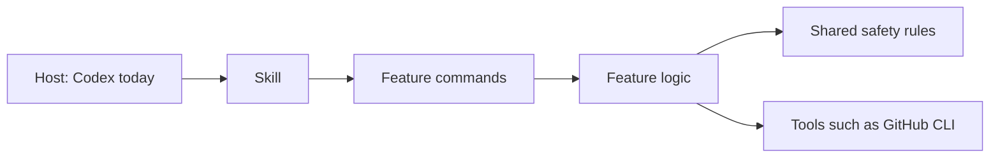
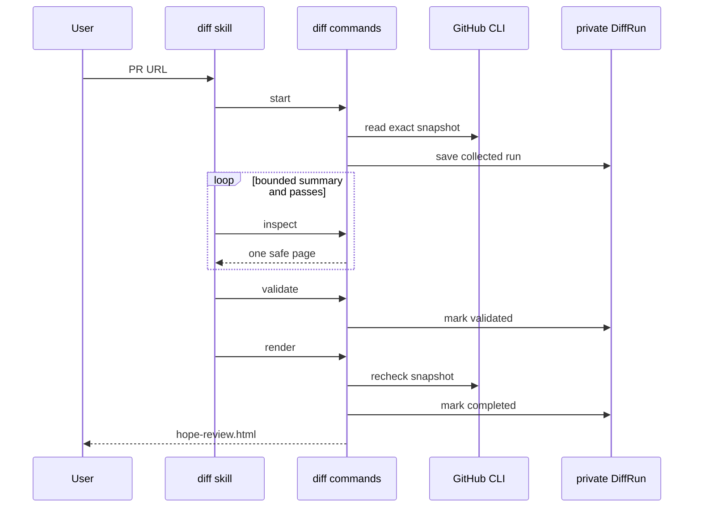
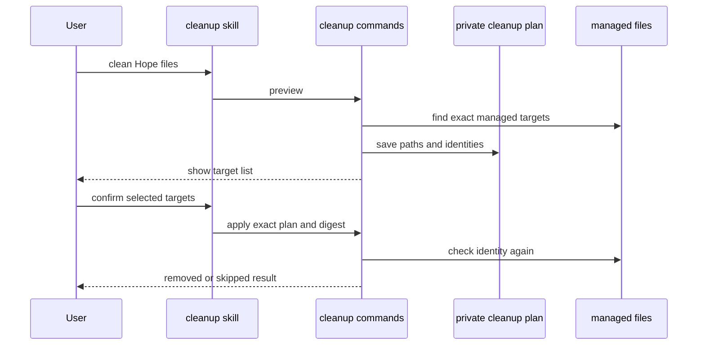

# Hope architecture

Hope is a useful plugin now and a growing harness inside. These are two views of
the same code.

[PRINCIPLES.md](../PRINCIPLES.md) defines the project direction. This document
describes the current technical shape.

## Main rule

Host files stay thin. Feature code owns the work.



A future Claude adapter belongs on the left side. It calls the same feature
commands. It does not copy diff or cleanup logic.

When diff has no URL, its feature command asks GitHub CLI for the most recently
created PR in the current repository. This lookup is part of diff, not the host
adapter, so every future host gets the same rule.

## Folders

```text
plugins/hope/
├── .codex-plugin/       Codex package information
├── skills/
│   ├── diff/            Diff instructions and a thin command entry
│   └── cleanup/         Cleanup instructions and a thin command entry
└── runtime/
    ├── diff/            Diff commands and DiffRun state
    ├── cleanup/         Cleanup preview and apply
    └── shared/          Small rules used by more than one feature
```

The older collector, inspector, validator, and renderer still live under the
diff skill. The new diff commands call them instead of replacing them. They can
move into `runtime/diff` later in small, tested changes.

## Diff sequence



`DiffRun` is a feature name. It records the diff workflow only. Hope does not
have a generic `Run` or `Runner` base class yet because no second feature needs
one.

## Cleanup sequence



Preview never deletes. Apply accepts only targets from that preview. A changed
or uncertain target is skipped.

Current targets are managed reviews and terminal diff runs. Exports and active
runs are outside cleanup. Branches are outside cleanup until Hope creates a
branch and stores its exact identity.

## Adding a feature

Start with the user's goal, not an abstract framework type.

For a feature named `example`:

1. Add `runtime/example` with plain commands and feature state if needed.
2. Add tests for success, retry, interruption, and cleanup.
3. Add `skills/example` only when an AI needs instructions to use it.
4. Keep the skill entry small. It should call the feature commands.
5. Move a rule into `runtime/shared` only when another feature uses it too.

Good names describe the thing: `DiffRun`, `CleanupPlan`, `BranchRecord`.
`ExampleRunner`, `Manager`, and `Engine` need a clear reason before they are
added.

## State rules

- State is private by default.
- Every state file has a schema version and revision.
- A command writes state atomically.
- A result stays successful even when later bookkeeping cleanup fails.
- Destructive work needs preview, confirmation, and a final identity check.
- Hope deletes only items it created and recorded.

## What comes next

The next useful work should come from dogfooding, not from filling empty
framework folders. Likely steps are:

1. record every diff inspection receipt in `DiffRun`;
2. separate trusted source facts from AI-written review text;
3. add a host adapter only when it can reuse the same commands;
4. add branch cleanup only with a real Hope branch creation feature;
5. add a standalone command only when the plugin flow proves its interface.
