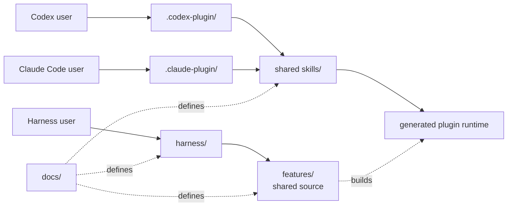

# Hope architecture

Hope separates an independent harness from plugin or skill entry points. They
are two ways into the same feature code. The boundaries exist now; no working
diff feature exists while the new implementation is being built.

[PRINCIPLES.md](../PRINCIPLES.md) defines the project direction.
[diff.md](diff.md) defines Hope diff.

## Two tracks



The harness runs without a plugin or AI host. A skill is a thin host adapter.
It may add instructions for an AI, but it does not own feature behavior.

The dependency direction is:

```text
harness -> features <- host adapters
```

Feature code never imports a skill, plugin manifest, or host adapter.

## Folders

```text
hope/
├── .claude-plugin/     Claude Code marketplace catalog
├── docs/               Shared product definitions
├── features/           Feature code used by every entry path
├── harness/            Independent Hope commands
├── plugins/hope/       Codex and Claude Code package
├── test/               Behavior and boundary tests
└── tools/              Project checks
```

Root `docs/` and `features/` are the only editable feature sources. The plugin
package contains generated copies because both hosts install `plugins/hope/`
as one package directory. `tools/build-plugin.mjs` creates those copies, and
the release check requires byte-for-byte generated content. Never edit a
generated copy by hand. The package includes every Hope file it uses, but its
JavaScript commands still require Node.js 20 or newer.

The package has two host manifests:

```text
plugins/hope/
├── .codex-plugin/plugin.json
├── .claude-plugin/plugin.json
├── skills/diff/SKILL.md
├── docs/                  generated product definitions
└── runtime/               generated feature code
```

The manifests are host adapters. They do not define feature behavior. The
shared skill may explain how each host locates the package, but it must reach
the same generated command.

## Current diff boundary

The retired diff implementation has been removed. Both entry paths reach the
same `features/diff` boundary, which currently stops with a clear rebuild
message. Do not describe this as a working review feature.

The next diff implementation starts from [diff.md](diff.md). It must add one
end-to-end useful path before new framework layers are introduced.

## Add a feature

1. Start with a clear user goal.
2. Put shared behavior in `features/<name>`.
3. expose it through `harness/`.
4. Add a thin skill only when an AI host needs one.
5. Add shared helpers only after two real features need the same rule.

Use names that describe the work or data. Do not add a generic runner,
manager, engine, registry, or base class without a concrete second use.
