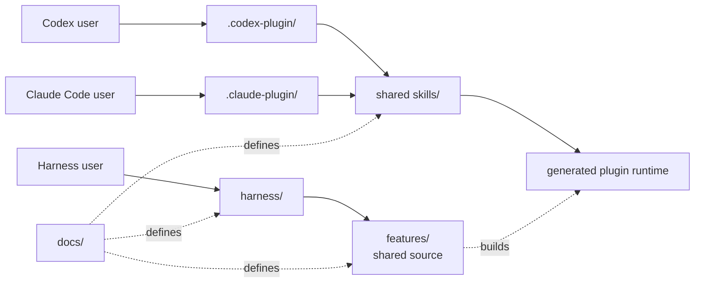

# Hope architecture

Hope separates an independent harness from plugin or skill entry points. They
are two ways into the same feature code. The Claude and Codex skill provide the
first complete diff path. The independent harness already owns the same
non-model boundaries and reports that its AI adapter is not available yet.

[PRINCIPLES.md](../PRINCIPLES.md) defines the project direction.
[diff.md](diff.md) defines Hope diff.
[design.md](design.md) defines the shared visual language.

## Two tracks



The harness runs without a plugin or AI host. A skill is a thin host adapter.
It may add instructions for an AI, but it does not own feature behavior.

The dependency direction is:

```text
harness -> features <- host adapters
```

Feature code never imports a skill, plugin manifest, or host adapter.

## Folders

```text
hope/
├── .claude-plugin/     Claude Code marketplace catalog
├── design/             Shared visual tokens and fixed assets
├── docs/               Shared product definitions
├── features/           Feature code used by every entry path
├── harness/            Independent Hope commands
├── locales/            Shared fixed interface text
├── plugins/hope/       Codex and Claude Code package
├── settings/           Shared user preference code
├── test/               Behavior and boundary tests
└── tools/              Project checks
```

Root `docs/`, `features/`, `settings/`, `locales/`, and `design/` are editable
sources. The plugin package contains generated copies because both hosts
install `plugins/hope/` as one package directory. `tools/build-plugin.mjs`
creates those copies, and the release check requires generated content to match
its source. Never edit a generated copy by hand. The package includes every
Hope file it uses, but its JavaScript commands still require Node.js 20 or
newer.

The root harness loads syntax-highlighting dependencies from the locked Node
package graph. The plugin build bundles the fixed highlighter, GitHub light and
dark code themes, and supported language grammars into its generated runtime.
The installed Claude or Codex plugin therefore does not depend on a separate
`node_modules` directory or a network request.

`tools/plugin-package-files.txt` is the explicit release boundary. The release
copies only those files into a new staging directory before creating the zip.
An unrelated or temporary file under `plugins/hope/` cannot enter a release by
accident.

The package has two host manifests:

```text
plugins/hope/
├── .codex-plugin/plugin.json
├── .claude-plugin/plugin.json
├── skills/diff/SKILL.md
├── skills/settings/SKILL.md
├── docs/                  generated product definitions
└── runtime/               generated feature code
```

The manifests are host adapters. They do not define feature behavior. The
shared skill may explain how each host locates the package, but it must reach
the same generated command.

## Current diff boundary

The current diff implementation starts from [diff.md](diff.md). It collects an
exact GitHub pull-request snapshot, exposes bounded inspection pages, validates
one structured analysis, rechecks the snapshot, and publishes one private
self-contained HTML file without replacing an existing file.

The Claude and Codex skill is the first complete AI analysis path. It can use
the active host session to produce a structured analysis. The independent
harness shares settings, collection, validation, rendering, and lifecycle code,
but must not claim automatic AI analysis until it has a real model adapter of
its own. This is still one feature implementation with two honest entry
boundaries, not separate diff implementations.

## Add a feature

1. Start with a clear user goal.
2. Put shared behavior in `features/<name>`.
3. expose it through `harness/`.
4. Add a thin skill only when an AI host needs one.
5. Add shared helpers only after two real features need the same rule.

Use names that describe the work or data. Do not add a generic runner,
manager, engine, registry, or base class without a concrete second use.
